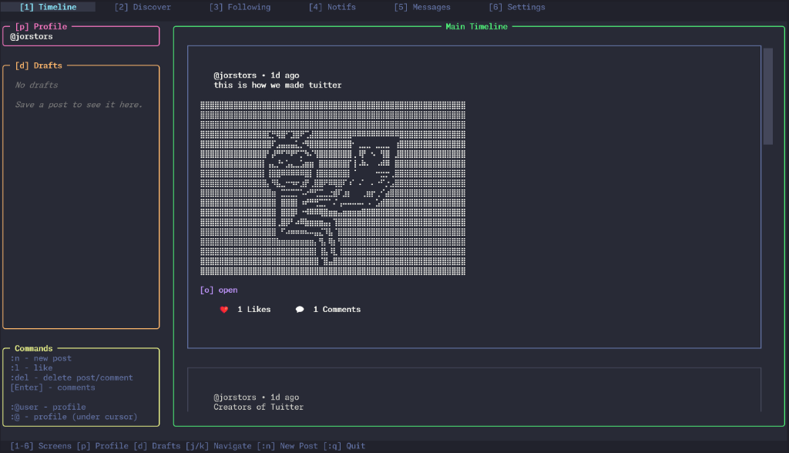
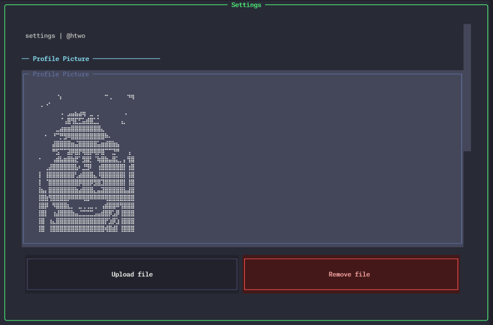
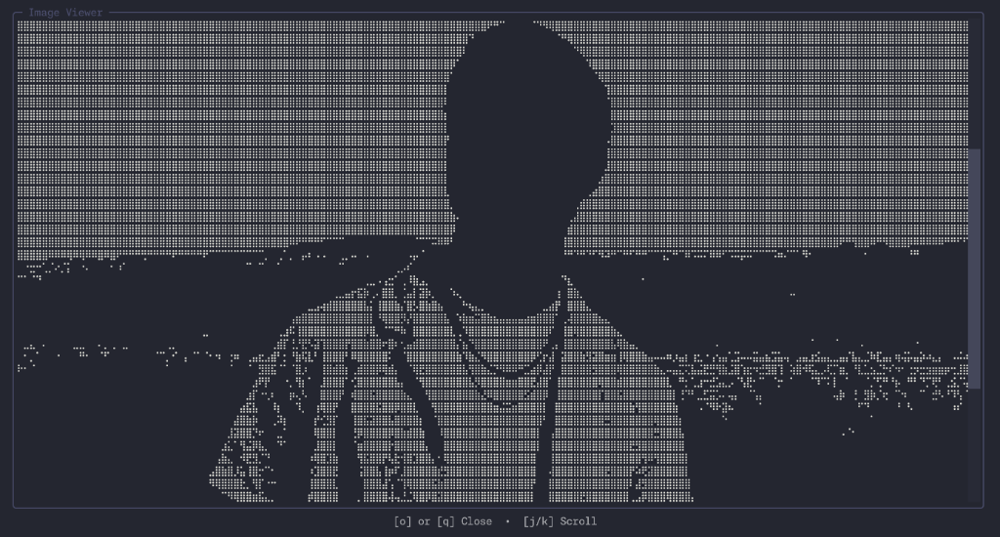
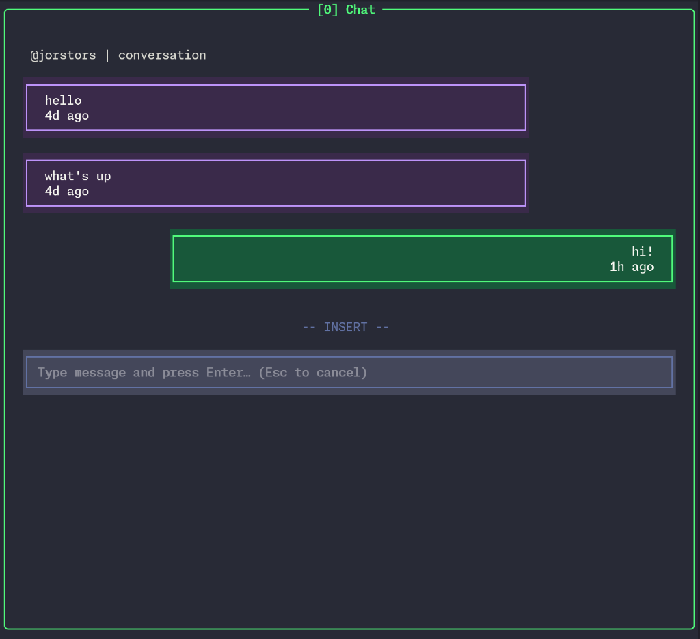

# Tuitter

**The terminal-native social experience.**

Tuitter is a high-performance, keyboard-first social client designed for developers and terminal enthusiasts. Built with a focus on speed, privacy, and aesthetic minimalism, it brings your social world directly into your dev environment.



---

## Features

### Performance and UX
- **Instant Navigation**: Switch between Timeline, Discover, and Messages with zero lag using global hotkeys 1-6.
- **Vim Power**: Navigate natively with j, k, h, l, gg, and G.
- **Seamless Flow**: Stay in your terminal. No context switching to heavy browser tabs.

### Rich Rendering
- **Media Viewer**: Open any post's media in a full-resolution ASCII/Braille modal with 'o'.
- **ASCII Avatars**: Generate and customize expressive profile pictures using the built-in generator.
- **Braille Art**: High-fidelity image-to-braille conversion for an aesthetic terminal experience.

### Privacy First
- **Local Storage**: Your tokens and settings are stored securely on your machine (keyring/DPAPI).
- **Direct Backend**: Communicates directly with our optimized FastAPI backend.

---

## Screenshots

| Timeline | Settings |
| :---: | :---: |
|  |  |

| Media Viewer | Chat View |
| :---: | :---: |
|  |  |

---

## Quick Start

### Recommended Installation (pipx)
The easiest way to install Tuitter is via [pipx](https://github.com/pypa/pipx), which handles virtual environment isolation and puts the command on your PATH.

```bash
pipx install tuitter
```

### One-Liner Installation scripts
If you don't have pipx or prefer an automated script:

**macOS / Linux / WSL:**
```bash
curl -fsSL https://raw.githubusercontent.com/tuitter/tuitter/main/install.sh | bash
```

**Windows (PowerShell):**
```powershell
irm https://raw.githubusercontent.com/tuitter/tuitter/main/install.ps1 | iex
```

### Advanced: Install from Source
```bash
pipx install "git+https://github.com/tuitter/tuitter.git"
```

---

## Global Shortcuts

| Key | Action |
| :--- | :--- |
| 1 - 6 | Switch Screens |
| p | View Profile |
| d | View Drafts |
| j / k | Navigate Down / Up |
| o | Open Full-Size Media |
| n | New Post |
| : | Command Mode (e.g., :q, :del) |
| esc | Close Modal / Cancel |

---

## Community and Support

- **Bugs and Features**: [GitHub Issues](https://github.com/tuitter/tuitter/issues)
- **Built With**: [Textual](https://textual.textualize.io/) and [FastAPI](https://fastapi.tiangolo.com/)

---
*Made for the terminal.*
